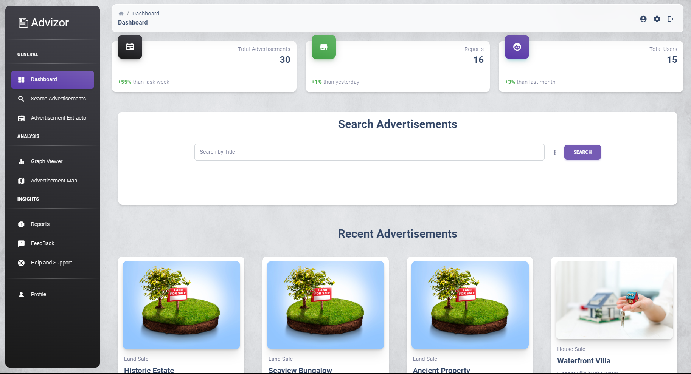

# Digital NewsPaper Advertisement Analyzer

 

The **Newspaper Ad Analyzer** is a powerful tool designed to simplify the process of extracting valuable information from newspaper advertisements. It uses state-of-the-art technologies including Optical Character Recognition (OCR), Natural Language Processing (NLP), and data visualization to transform unstructured newspaper ads into structured data for analysis and insight.
Visit the ongoing Demo site [here](https://newspaper-analyzer.web.app)

## Key Features

- **Advertisement Categorization**: Automatically categorizes advertisements into various types such as land sale, house sale, wedding proposals, and more, making it easier to find relevant information.

- **Data Extraction**: Extracts key details from advertisements, including dates, locations, contact information, and other important information, storing them in a structured database.

- **Geospatial Visualization**: Visualizes the geographic locations of advertisements on an interactive map, allowing users to explore ads by location and view additional details by clicking on map markers.

- **Interactive Data Analysis**: Provides powerful data analysis tools, including interactive graphs and search facilities, enabling users to gain insights from the collected data.

- **User-Friendly Interface**: A user-friendly dashboard allows easy access to all the system's functionalities, making it accessible to a wide range of users.

## Getting Started

To get started with the Newspaper Ad Analyzer, follow the installation instructions in the [documentation](link-to-documentation) and explore its capabilities. Feel free to contribute to the project and make it even more powerful!

## Technologies Used

- Frontend: React.js, Material-UI
- Backend: Python Flask, MongoDB
- Data Processing: OCR/Tesseract, NLP (Natural Language Processing)
- Visualization: Leaflet.js, Chart.js

## Contributors

- [Chanuka Lakshan Chandra Yapa](https://github.com/Chanuka-ChandraYapa) - Frontend Developer
- [Nadun Sanjeevana](https://github.com/NadunSanjeevana) - Backend Developer
- [Tharindu Madhusanka](link-to-contributor2-profile) - NLP Developer

## License

This project is licensed under the [MIT License](LICENSE.md).

#### Special thanks

During the development of this dashboard, we have used many existing resources from awesome developers. We want to thank them for providing their tools open source:

- [CreativeTim](https://www.creative-tim.com) - The React UI library for faster and easier web development.
- [MUI](https://mui.com/) - The React UI library for faster and easier web development.
- [React ChartJS 2](http://reactchartjs.github.io/react-chartjs-2/#/) - Simple yet flexible React charting for designers & developers.
- [ChromaJS](https://gka.github.io/chroma.js/) - A small-ish zero-dependency JavaScript library for all kinds of color conversions and color scales.

Let us know your thoughts below. And good luck with development!

## Quick start

- Clone the repository
- Download and Install NodeJs LTS version from [NodeJs Official Page](https://nodejs.org/en/download/).
- Navigate to the root ./ directory of the product and run `yarn install` or `npm install` to install our local dependencies.
